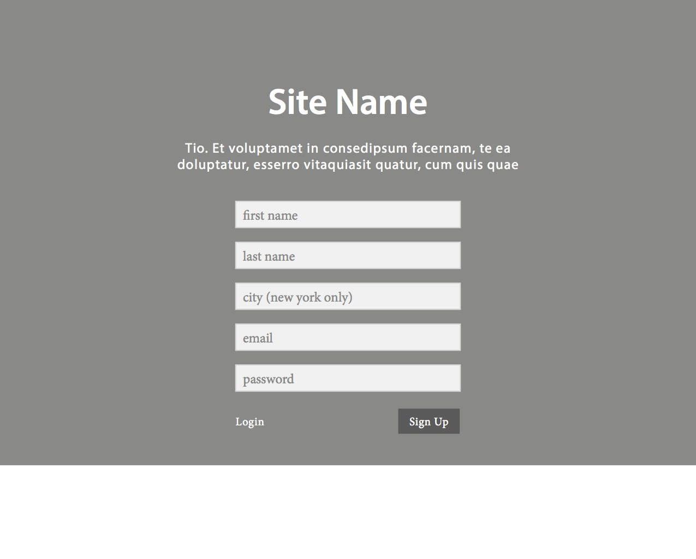
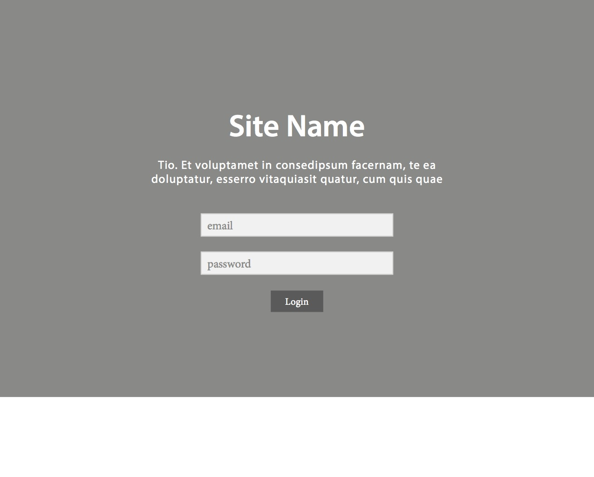
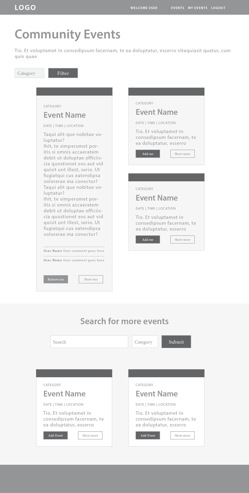
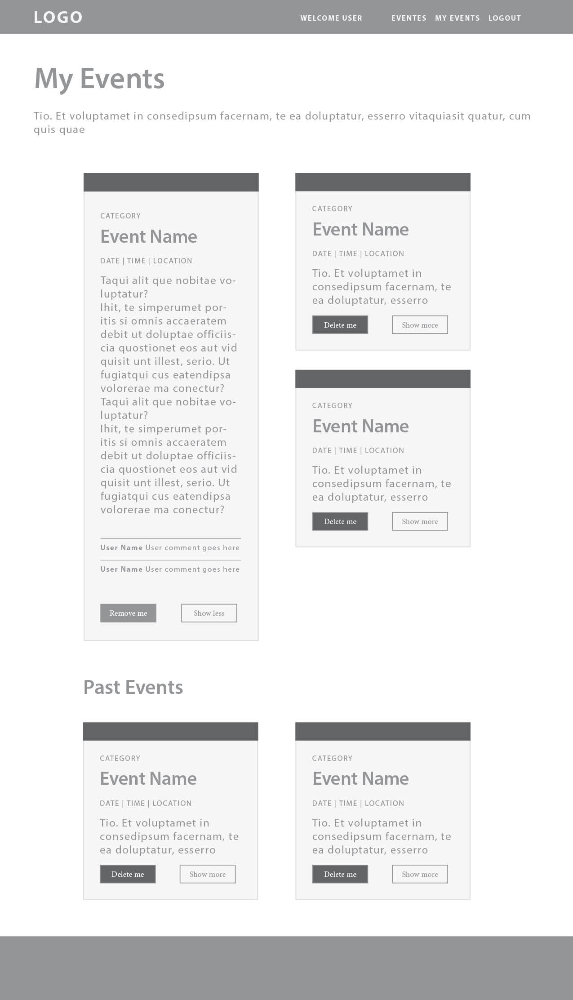
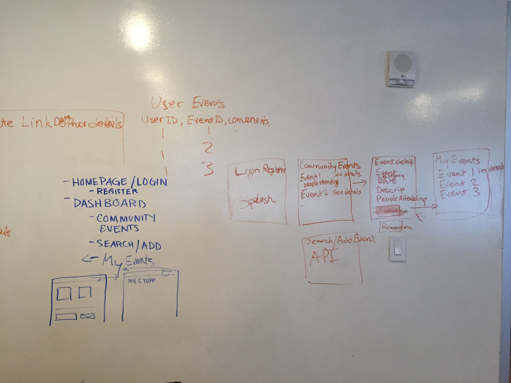
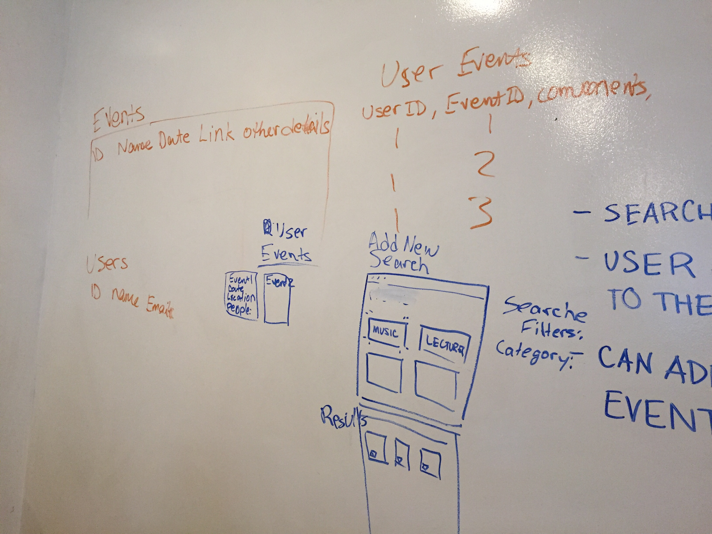
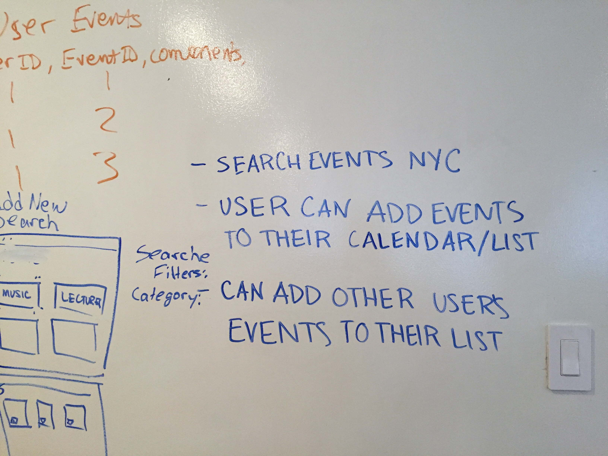

# Project Intro
We are going to create a SPA using Postgres (pg-promise) & Express to build an API and a React front-end that consumes it.

https://frozen-atoll-82939.herokuapp.com/

## Project Proposal

### Have you ever been to a bad meetUp.com Event in NYC?

* The event was poorly planed and you would of never went if you knew that ahead of time.

* You really **love** what **NYC** has to offer but just can't seem to find that right event or even were to start looking. MeetUp.com can be **overwhelming** with all those choices. It would be great if there was something that did all that guess work for you.

* Most of all, you didn't have any one to go **with !** Would it not be great if you and your friends could remotely agree to go to an event? Or **Share a Great MeetUp** with the Community that no one has heard of.    **DON'T Worry We Got You!**

## My_NYC_Community_Events.APP
Here at DiamondDogs inc. We believe that there should be an app that takes care of all of this for you. With this exclusive membership to a Community of tried and tested events, you can't go wrong. The best part is that you can see if your friends are going and if any one in the Community as already gone.

**DiamondDogs inc** would like to build this app with the vision of keeping in contact with all of our **Bowie** classmates via fun, active, engaging, NYC events via meetup.com's api. We will take out the guess work and at the same time build a Community of events we can enjoy while keeping up with each other after the immersive here at WDI.

**Investors** With you sponsorship we can make this vison a real, living, breathing, APP. **Thank You for you Time.**

---
#### User Stories:

1. I as a user  can register to join.

1. I as a user Can use my email and password to login to the site.

1. I as a user can see the list of upcoming meetup.com events that all users have posted.

1. I as a user can filter the list of upcoming meetup.com events by category.

1. I as a user can as a user should be able to click to see the details of an event.

1. I as a user when viewing the details of an event should be able to easily see: Name of event, Date and Time, Description, event url, and others who have signed up.

1. I as should be able to sign up for an event.

1. I as a user should be able to remove myself from an event.

1. I as a user should be able to search for events from meetUp.com.

1. As a user I should be able to search for a topic by category.

1. As a user I should see a list of events that match the topic and category I searched for.

1. I as a user when viewing the details of an event should be able to easily see: Name of event, Date and Time, Description, event url.

1. As a user I should be able to add an event I searched for from meetUp.com to all events that all users have posted.

1. As a user I should be able to see a list of events I am attending.

1. As a user I should be able to see a list of events I have attended.

1. As a user I should see be able to remove myself from upcoming events.

1. As a user I should see be able to remove myself from pasted events.

1. I as a user when viewing my events the details of an event should be able to be easily see: Name of event, Date and Time, Description, event url, and others who have signed up.

1. I as a user should know when I am logged out.

#### Wire Frames:
###### (landing Page)

###### (Sign Up Section)

###### (User Dashboard Section) / Main display

###### (User Dashboard Section) / My Events Section

---
### Routes
| Action | Route | Function | DB function | REACT Component |
|--------|--------------------|---------------------------------------------------------------------------------------------------------|--------------------|-----------------|
| GET | / | Renders index.ejs, which is populated by REACT | N |  |
| POST | /users | Adds a new user (to be used in conjunction with new user form) | db.createUser |  |
| POST | /users/login | To login in as the user (to be used in conjunction with the login view) | db.loginUser |  |
| GET | /events | JSON representation of all upcoming events for the community (pulled from the DB) | db.showCommEvents | CommEvents |
| GET | /events/me | JSON representation of all events for the logged in user | db.showUserEvents | UserEvents |
| POST | /events | Adds a new event to the DB (events come from the search results from meetup) | db.addCommEvent | Actions |
| GET | /events/:event_id | JSON representation of single event | db.showOneEvent | Events |
| POST | /events/:event_id | Adds event to the user's listing of events | db.deleteUserEvent | Actions |
| DELETE | /events/:event_id | Removes an event from the user's list | db.addUserEvent | Actions |
| GET | /events/search/?qs | Render JSON results from the Meetup API, passing the search term, category id, city, state, and country | N |  |

---

### ERD's:

---
### WhiteBoard Screen Shots:

